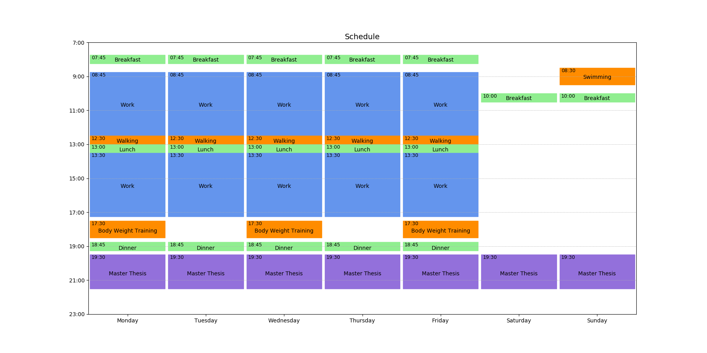
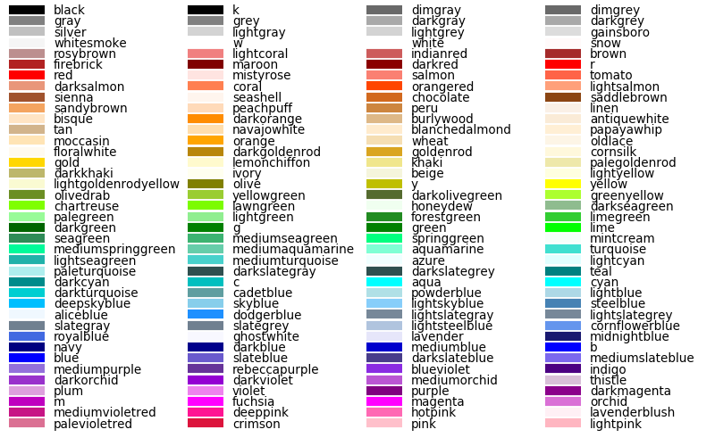

# Weekplot
Reads & plots your weekly schedule from a text file.



## Install Dependencies
``` sh
pip3 install -r requirements.txt
```

## Usage
``` sh
python3 weekplot.py events.txt
```

Here's an [example input file.](events.txt)

## Colors
You can use the following colors in your input file:


